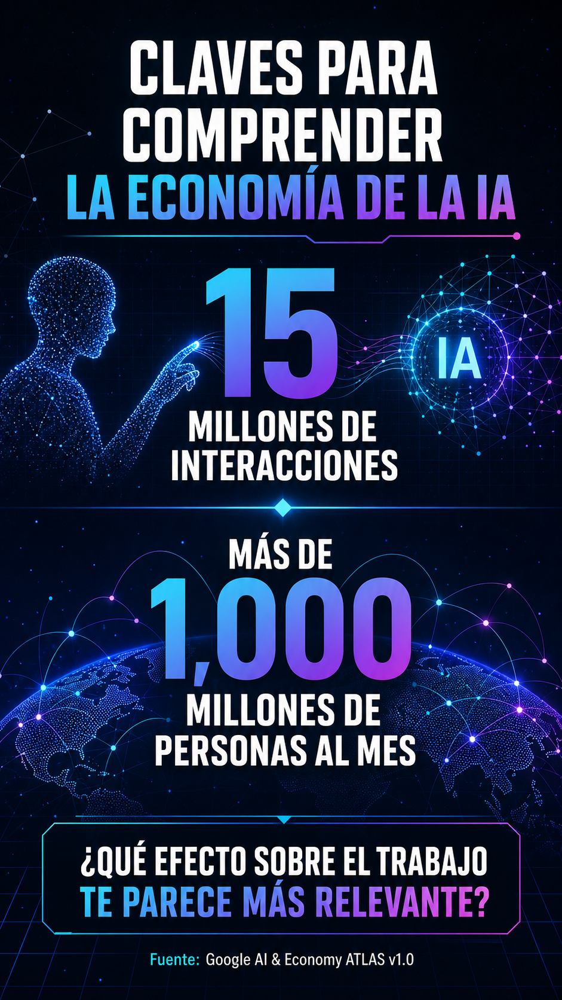

# Paquete de revisión editorial · ATLAS

Estado: **pendiente de aprobación humana**  
Publicación habilitada: **no**  
Acciones externas habilitadas: **no**

## Pieza visual

## Historia y fuente

**Título:** Claves para comprender la economía de la IA  
**Fuente:** [Google AI & Economy ATLAS v1.0](https://blog.google/intl/es-419/noticias-de-la-empresa/understanding-the-ai-economy/)  
**Fecha de la fuente:** 23 de julio de 2026  
**Puntaje editorial:** 80.25/100

### Resumen factual completo

Para ayudar, Google lanza la primera versión del ATLAS de IA y economía
(Activity, Task, Landscape, and Adoption Study), un estudio continuo, a gran
escala y anónimo sobre cómo las personas usan los productos y las herramientas
de IA de Google. El primer conjunto de datos de ATLAS (v1.0) se basa en 15
millones de interacciones agregadas y anonimizadas entre humanos y la IA en la
aplicación de Gemini, el Modo IA y la API de Gemini, que en conjunto son
utilizados por más de 1,000 millones de personas al mes. Las estadísticas de
ATLAS v1.0 abarcan más de 150 países, 140 idiomas, 800 ocupaciones y 4,000
tareas.

## Guion de 30 segundos

**Gancho:** Claves para comprender la economía de la IA.

**Contexto:** 15 millones de interacciones · más de 1,000 millones de personas
al mes.

**Lectura Estratosférica:** Conviene distinguir el hecho confirmado de las
consecuencias que todavía deben evaluarse.

**Por qué importa:** Cualquier consecuencia debe comprobarse a partir de la
evidencia disponible.

**Cierre:** ¿Qué efecto de esta noticia sobre el trabajo te parece más
relevante?

## Storyboard

| Tiempo | Función | Texto o narración |
|---|---|---|
| 0–3 s | Gancho | Claves para comprender la economía de la IA |
| 3–8 s | Hecho confirmado | 15 millones de interacciones · más de 1,000 millones de personas al mes |
| 8–13 s | Separar hechos de interpretación | Esta pieza separa el hecho confirmado de sus posibles consecuencias |
| 13–20 s | Lectura editorial | Las consecuencias todavía deben evaluarse |
| 20–26 s | Límite de evidencia | No completar vacíos sin evidencia |
| 26–30 s | Conversación | ¿Qué efecto sobre el trabajo te parece más relevante? |

## Texto recomendado

Claves para comprender la economía de la IA.

15 millones de interacciones y más de 1,000 millones de personas al mes.

¿Qué efecto de esta noticia sobre el trabajo te parece más relevante?

Responde: Productividad / Empleo / Creatividad / Organización.

## Lista de aprobación

- [ ] La fuente y las cifras son correctas.
- [ ] El enfoque editorial es claro y prudente.
- [ ] El diseño es legible y coherente con La Estratosférica.
- [ ] El guion cabe en 30 segundos.
- [ ] La pregunta final es útil para la comunidad.
- [ ] La pieza puede avanzar a producción, sin autorizar su publicación.

## Decisión

- [ ] Aprobar editorialmente.
- [ ] Solicitar cambios.
- [ ] Rechazar.

La aprobación de este paquete **no concede permiso de publicación**.
