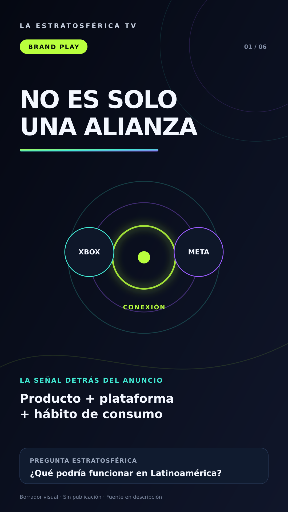
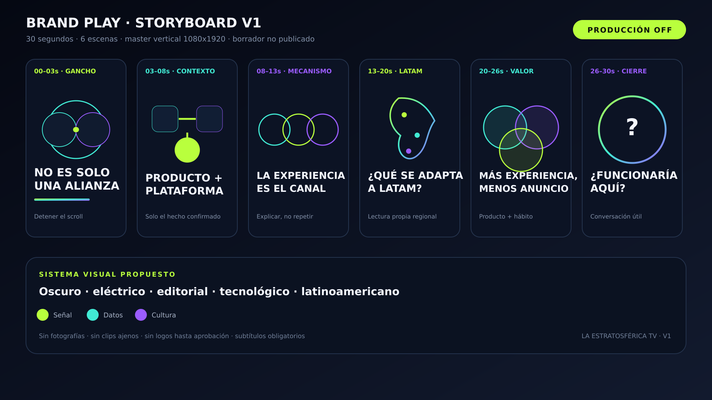

# Sistema visual V1 — Brand Play

> Concepto visual en revisión. No autoriza producción ni publicación.

## Fotograma vertical

## Storyboard completo

## Dirección

- Oscuro: fondo editorial y tecnológico.
- Verde señal: descubrimiento y oportunidad.
- Cian datos: información y verificación.
- Violeta cultura: interpretación y creatividad.
- Tipografía de alto contraste para lectura móvil.
- Gráficos vectoriales originales, sin fotografías ni clips ajenos.

## Estado

- Producción: desactivada.
- Voz: no generada.
- Música: no generada.
- Redes sociales: desconectadas.
- Revisión humana: pendiente.
